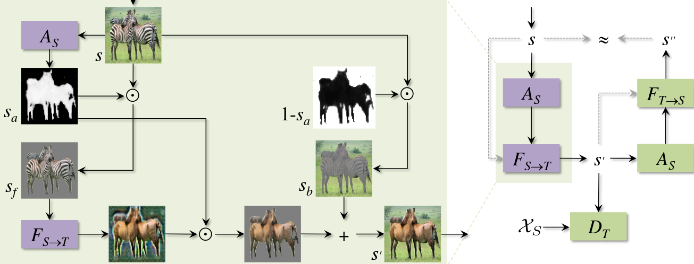
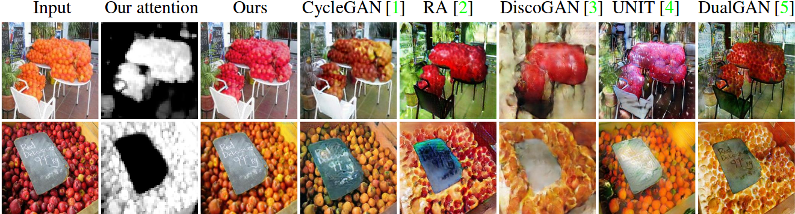

# Pytorch-Attention-Guided-CycleGAN

Attempt at Pytorch implementation of <a href='https://arxiv.org/pdf/1806.02311.pdf'>Unsupervised Attention-guided
Image-to-Image Translation</a>.


This architecture uses an attention module to identify the foreground or salient parts of the images onto which image translation is to be done.

Some of the results shown in the paper - 

# How to run
Download dataset
```bash
bash datasets/download_datasets.sh <cyclegan dataset arguement>
```
Train
```bash
train.py
```
optional arguments 
```shell
--resume <checkpoint path to resume from>
--dataroot <root of the dataset images>
--LRgen <lr of generator>
--LRdis <lr of discriminator>
--LRattn <lr of attention module>
```
